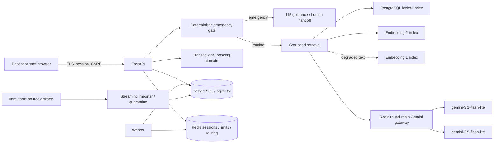

# VMEC-01 Data Flow

Raw patient text is confined to the minimum application path and is excluded from model telemetry, metrics, logs, and safe exports. Source provenance and citation mappings survive every import and retrieval step.

